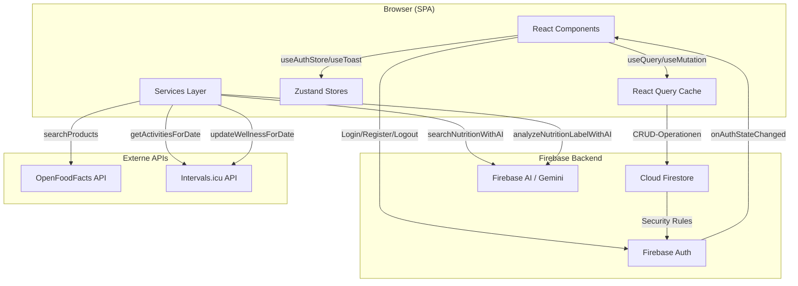
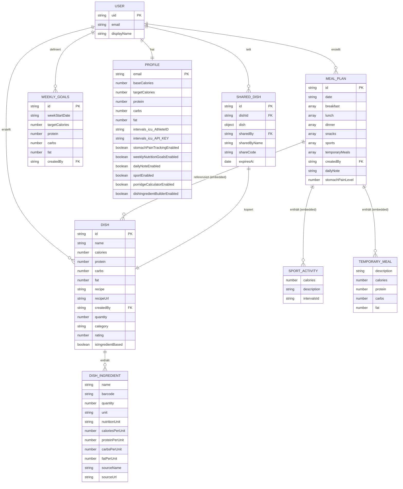

# Software Design Document (SDD) — Weekly Food Planner (WFP)

---

## 1. Executive Summary

**Weekly Food Planner (WFP)** ist eine React-basierte Single-Page-Application zur tagesgenauen Mahlzeitenplanung und Nährwert-Erfassung. Nutzer erstellen Gerichte (manuell oder KI-gestützt via Gemini), ordnen sie Mahlzeiten des Tages zu und tracken Kalorien, Protein, Kohlenhydrate und Fett gegen individuelle oder wöchentliche Zielwerte. Zusätzlich werden Sportaktivitäten aus Intervals.icu synchronisiert, ein Porridge-Kalkulator bereitgestellt und Gerichte per Share-Code geteilt. Die Persistenz erfolgt über Cloud Firestore, die Authentifizierung über Firebase Auth (E-Mail/Passwort).

---

## 2. Tech-Stack & Abhangigkeiten

### Runtime

| Technologie | Version | Zweck |
|---|---|---|
| React | 18.2.0 | UI-Framework |
| React Router DOM | 6.22.0 | Client-seitiges Routing (SPA) |
| TypeScript | 5.2.2 | Statische Typisierung |
| Firebase SDK | 12.5.0 | Auth, Firestore, AI (Gemini) |
| TanStack React Query | 5.64.0 | Server-State, Caching, Mutations |
| Zustand | 4.5.0 | Leichtgewichtiger Client-State |
| MUI Material | 6.3.1 | UI-Komponenten-Bibliothek |
| Headless UI | 2.2.0 | Zugangliche Headless-Komponenten |
| Emotion | 11.14.0 | CSS-in-JS (MUI-Dependency) |
| date-fns | 4.1.0 | Datum-Utility |
| Tailwind CSS | 3.4.1 | Utility-First Styling |

### Build & Dev

| Technologie | Version | Zweck |
|---|---|---|
| Vite | 5.1.0 | Build-Tool, Dev-Server, HMR |
| PostCSS | 8.4.35 | CSS-Transformation (Tailwind) |
| Autoprefixer | 10.4.17 | Vendor-Prefixing |
| Playwright | 1.49.1 | E2E-Tests |

### Externe APIs

| API | Zweck |
|---|---|
| OpenFoodFacts (Search-a-licious) | Lebensmittel-Suche nach Nährwerten |
| Gemini 2.5 Flash (Firebase AI) | KI-gestützte Nährwert-Suche & Etikett-Analyse |
| Intervals.icu | Sport-Aktivitäten importieren, Wellness-Daten exportieren |

### Hosting & Infrastruktur

| Dienst | Konfiguration |
|---|---|
| Firebase Hosting | Site `ernaehrungsplan`, SPA-Rewrite auf `/index.html` |
| Cloud Firestore | Projekt `wfp-weekly-food-planner` |
| Firebase Auth | E-Mail/Passwort-Provider |
| GitHub Actions | CI/CD: Playwright-Tests, Firebase-Deploy on merge |

---

## 3. Architektur-Analyse

### 3.1 Architekturmuster

**Client-seitiger Monolith** — Die gesamte Anwendungslogik (Routing, State, Business-Logic, API-Aufrufe) residiert im Browser. Es gibt keine eigene Backend-Schicht; Firebase-Dienste (Auth, Firestore, AI) werden direkt aus dem Client angesprochen. Die Firestore Security Rules bilden die einzige serverseitige Zugriffslogik.

### 3.2 Komponentenhierarchie (Textform)

```
App (BrowserRouter)
├── Toast (global)
├── /login → LoginForm
├── /register → RegisterForm
└── AuthRedirect (Auth-Gate)
    └── ProtectedLayout (Header + Outlet + MobileTabBar)
        ├── / | /day-planning → DayPlanningPage
        │   └── MealPlanForm
        │       ├── WeekCalendar
        │       ├── WeeklyNutritionGoalsForm
        │       ├── NutritionSummary
        │       │   ├── CalorieCard
        │       │   ├── DeficitCard
        │       │   └── NutrientCard (×3: Protein, Carbs, Fat)
        │       ├── MealSection (×3: Fruhstuck, Mittag, Abend)
        │       │   └── DishItem
        │       │       └── QuantitySelector
        │       ├── SnacksAndExtrasSection
        │       ├── SportSection
        │       ├── StomachPainTracker
        │       └── MealPlanActions
        ├── /dashboard → Dashboard
        ├── /dishes → DishesPage
        │   └── DishList
        │       ├── DishFilter
        │       └── DishCard[]
        ├── /dishes/new | /dishes/:id/edit → DishForm
        ├── /dishes/create-with-ingredients → CreateDishWithIngredients
        ├── /dishes/:id/edit-ingredients → EditDishWithIngredients
        ├── /dishes/import | /shared-dish/:shareCode → ImportDishPage
        ├── /porridge → PorridgeCalculator (Early Access)
        └── /profile → ProfilePage
            ├── UserSettingsForm
            └── NutritionGoalsForm
```

### 3.3 Datenfluss (Mermaid)



### 3.4 Schichtenmodell

```
┌─────────────────────────────────────────────────────┐
│  Presentation Layer                                  │
│  React Components (meal-planning, dishes, auth,     │
│  layout, shared, porridge, ui)                      │
├─────────────────────────────────────────────────────┤
│  State Layer                                         │
│  React Query (Server-State) + Zustand (Client-State)│
├─────────────────────────────────────────────────────┤
│  Data Access Layer                                   │
│  src/lib/firestore.ts (monolithisch)                │
│  Firestore CRUD + React Query Hooks + Typen         │
├─────────────────────────────────────────────────────┤
│  Services Layer                                      │
│  gemini.service.ts | openfoodfacts.service.ts       │
│  intervals.service.ts                               │
├─────────────────────────────────────────────────────┤
│  Infrastructure                                      │
│  Firebase SDK (Auth, Firestore, AI)                 │
│  src/firebase.ts (App-Instanz)                      │
└─────────────────────────────────────────────────────┘
```

---

## 4. Feature-Katalog

### 4.1 Kern-Features

| # | Feature | Modul/Dateien | Beschreibung |
|---|---|---|---|
| F1 | **Tagesplanung** | `MealPlanForm`, `MealSection`, `DishItem` | Mahlzeiten (Frühstück, Mittag, Abendessen, Snacks) pro Tag zusammenstellen, Gerichte aus der Bibliothek zuweisen |
| F2 | **Nährwert-Tracking** | `NutritionSummary`, `CalorieCard`, `DeficitCard`, `NutrientCard` | Echtzeit-Berechnung von Kalorien, Protein, Carbs, Fett gegen Tagesziele |
| F3 | **Gericht-Verwaltung** | `DishesPage`, `DishList`, `DishCard`, `DishForm`, `DishFilter` | CRUD für Gerichte mit Kategorie, Rating (1-5 Sterne), Rezept-URL |
| F4 | **Zutatenbasierte Gerichte** | `CreateDishWithIngredients`, `EditDishWithIngredients` | Gericht aus einzelnen Zutaten zusammenbauen; Nährwerte werden automatisch aggregiert |
| F5 | **KI-Nährwert-Suche** | `gemini.service.ts` | Gemini 2.5 Flash sucht Nährwerte per Textquery; analysiert Fotos von Nährwerttabellen |
| F6 | **OpenFoodFacts-Suche** | `openfoodfacts.service.ts` | Produktsuche in der OpenFoodFacts-Datenbank (Search-a-licious API) |
| F7 | **Sport-Integration** | `SportSection`, `intervals.service.ts` | Sportaktivitäten manuell oder aus Intervals.icu importieren; verbrannte Kalorien ins Defizit einrechnen |
| F8 | **Gericht-Sharing** | `ShareDialog`, `ImportDishPage` | 8-stelliger Share-Code mit 7-Tage-Ablauf; Import in eigene Bibliothek |
| F9 | **Wochen-Ernährungsziele** | `WeeklyNutritionGoalsForm` | Pro Woche (Mo-So) individuelle Zielwerte setzen, die Tagesziele überschreiben |
| F10 | **Mengen-Selektor** | `QuantitySelector` | Dezimale Mengenangabe pro Gericht (0.1 - unbegrenzt), deutsche Lokalisierung |

### 4.2 Zusatz-Features

| # | Feature | Modul/Dateien | Beschreibung |
|---|---|---|---|
| F11 | **Porridge-Kalkulator** | `PorridgeCalculator`, `porridgeConfig.ts` | Spezial-Rechner für Haferbrei-Zusammensetzung (Early Access) |
| F12 | **Bauchweh-Tracking** | `StomachPainTracker` | Tägliche Skala 0-10 (Feature-Toggle) |
| F13 | **Tagesnotiz** | In `MealPlanActions` | Freitextfeld pro Tag (Feature-Toggle) |
| F14 | **Wochenkalender** | `WeekCalendar`, `MonthCalendar` | Datumsnavigation mit visueller Markierung existierender Pläne |
| F15 | **Dark Mode** | `ThemeToggle`, `theme.ts` | Klassen-basierter Dark Mode via Tailwind |
| F16 | **Early-Access-System** | `earlyAccessFeatures.ts`, `useFeatureAccess` | Feature-Gates per E-Mail-Whitelist + Profil-Toggle |
| F17 | **Wellness-Sync** | `intervals.service.ts` | Beim Speichern eines Tagesplans wird `kcalConsumed` an Intervals.icu gepusht |

### 4.3 Authentifizierung & Benutzerverwaltung

| # | Feature | Modul/Dateien |
|---|---|---|
| F18 | E-Mail/Passwort Login | `LoginForm`, `authStore` |
| F19 | Registrierung | `RegisterForm` |
| F20 | Profil-Verwaltung | `ProfilePage`, `UserSettingsForm`, `NutritionGoalsForm` |
| F21 | Passwort/E-Mail-Änderung | `UserSettingsForm` (mit Re-Authentifizierung) |

---

## 5. Datenmodell

### 5.1 Entitäten & Beziehungen (Mermaid)



### 5.2 Firestore-Collections

| Collection | Dokument-ID | Zugriffsmuster | Indizes |
|---|---|---|---|
| `dishes` | Auto-ID | `createdBy == uid` | keiner (einfacher where-Filter) |
| `mealPlans` | Auto-ID | `createdBy == uid` + `date == X` | Composite: `(createdBy ASC, date ASC)` |
| `weeklyNutritionGoals` | Auto-ID | `createdBy == uid` + `weekStartDate == X` | Composite: `(createdBy ASC, weekStartDate ASC)` |
| `profiles` | User-E-Mail | `email == auth.token.email` | keiner |
| `sharedDishes` | Auto-ID | `shareCode == X` + `expiresAt > now` | Composite: `(shareCode ASC, expiresAt ASC)` |

### 5.3 Wichtige Design-Entscheidungen

- **Embedded Dishes in MealPlan**: Gerichte werden als Kopie in `mealPlans` eingebettet, nicht als Referenz. Das ermöglicht historische Konsistenz (Änderungen am Gericht betreffen vergangene Pläne nicht), erzeugt aber Daten-Duplikation.
- **Profile via E-Mail-ID**: Das Profil-Dokument verwendet die E-Mail als ID statt der UID. Das ist eine Abweichung vom üblichen Pattern und koppelt Profil an die E-Mail-Adresse.
- **SharedDish als Full Copy**: Beim Teilen wird das gesamte Gericht-Objekt in `sharedDishes` kopiert, nicht referenziert. Das vermeidet Cross-User-Reads, erhöht aber die Datenmenge.

---

## 6. Schnittstellen (APIs)

### 6.1 Interne Firestore-API (`src/lib/firestore.ts`)

Die gesamte Datenbankschicht ist in einer einzigen Datei (798 Zeilen) konsolidiert:

#### Dishes

| Hook | Operation | Firestore-Methode |
|---|---|---|
| `useDishes()` | Alle Gerichte des Users lesen | `getDocs(query(where createdBy))` |
| `useDish(id)` | Einzelnes Gericht lesen | `getDoc(doc)` |
| `useCreateDish()` | Gericht erstellen | `addDoc` |
| `useUpdateDish()` | Gericht aktualisieren | `updateDoc` + Cache-Update |
| `useDeleteDish()` | Gericht löschen | `deleteDoc` |
| `useUpdateDishRating()` | Rating aktualisieren | `updateDoc(rating)` |

#### MealPlans

| Hook | Operation | Firestore-Methode |
|---|---|---|
| `useMealPlans()` | Alle Pläne des Users | `getDocs(query(where createdBy))` |
| `useMealPlanByDate(date)` | Plan für Datum | `getDocs(query(where createdBy + date))` |
| `useCreateMealPlan()` | Plan erstellen | `addDoc` |
| `useUpdateMealPlan()` | Plan aktualisieren | `updateDoc` |
| `useDeleteMealPlan()` | Plan löschen | `deleteDoc` |

#### Weekly Nutrition Goals

| Hook | Operation |
|---|---|
| `useWeeklyNutritionGoals(weekStartDate)` | Wochenziele lesen |
| `useCreateWeeklyNutritionGoals()` | Wochenziele erstellen |
| `useUpdateWeeklyNutritionGoals()` | Wochenziele aktualisieren |
| `useDeleteWeeklyNutritionGoals()` | Wochenziele löschen |

#### Sharing

| Hook | Operation |
|---|---|
| `useShareDish()` | Gericht teilen (generiert Share-Code) |
| `useGetSharedDishByCode(code)` | Geteiltes Gericht abrufen |
| `useImportSharedDish()` | Geteiltes Gericht in eigene Bibliothek importieren |

#### Nutrition Goals

| Hook | Operation |
|---|---|
| `useNutritionGoals()` | Globale Ernährungsziele aus Profil lesen |

### 6.2 Gemini AI Service (`src/services/gemini.service.ts`)

| Funktion | Input | Output | Timeout |
|---|---|---|---|
| `searchNutritionWithAI(query)` | Suchbegriff (min. 3 Zeichen) | `SearchableProduct \| null` | 15s |
| `analyzeNutritionLabelWithAI(base64, mime)` | Base64-Bild + MIME-Type | `GeminiNutritionResponse \| null` | keiner |
| `isGeminiAvailable()` | — | `boolean` | — |

**Modell**: `gemini-2.5-flash` mit `thinkingBudget: 0` (deaktiviert)
**Backend**: `GoogleAIBackend` via Firebase AI SDK (dynamischer Import)

### 6.3 OpenFoodFacts Service (`src/services/openfoodfacts.service.ts`)

| Funktion | Input | Output |
|---|---|---|
| `searchProducts(query)` | Suchbegriff | `SearchableProduct[]` |
| `productToIngredient(product, qty)` | Produkt + Menge | `DishIngredient` |
| `debounce(fn, wait)` | Funktion + Delay | Debounced Funktion |

**Endpoint**: `https://search.openfoodfacts.org/search`
**Dev-Proxy**: `/api/openfoodfacts` (via Vite-Config)
**Parameter**: `langs=de,en`, `page_size=10`, `fields=product_name,product_name_de,product_name_en,code,nutriments`

### 6.4 Intervals.icu Service (`src/services/intervals.service.ts`)

| Methode | HTTP | Endpoint | Zweck |
|---|---|---|---|
| `getActivitiesForDate(date)` | GET | `/athlete/{id}/activities?oldest={date}&newest={date}` | Aktivitäten für Datum abrufen |
| — (Detail-Abruf) | GET | `/activity/{id}` | Detail-Daten pro Aktivität |
| `updateWellnessForDate(date, kcal)` | PUT | `/athlete/{id}/wellness/{date}` | Kalorienverbrauch übertragen |

**Auth**: Basic Auth (`API_KEY:{apiKey}`), Credentials aus Firestore-Profil

### 6.5 Firestore Security Rules

```
dishes:        R/W nur wenn createdBy == auth.uid
mealPlans:     R/W nur wenn createdBy == auth.uid
weeklyGoals:   R/W nur wenn createdBy == auth.uid
profiles:      R/W nur wenn email == auth.token.email
sharedDishes:  Create: jeder authentifizierte User
               Read:   jeder authentifizierte User (fuer Share-Code-Abfrage)
               Update/Delete: nur wenn sharedBy == auth.uid
```

---

## 7. Refactoring-Potenzial

### 7.1 Kritisch — Architektonische Probleme

#### R1: God-File `src/lib/firestore.ts` (798 Zeilen)

**Problem**: Diese Datei vereint Firebase-Initialisierung, alle TypeScript-Interfaces, sämtliche CRUD-Funktionen für 5 Collections, alle React-Query-Hooks und die Sharing-Logik. Sie ist das zentrale Nadelöhr der gesamten Anwendung.

**Auswirkung**: Jede Änderung an einer beliebigen Entität erfordert Modifikation dieser Datei. Tree-Shaking ist ineffektiv, da alles aus einem Modul importiert wird. Testing ist erschwert, da alle Abhängigkeiten gekoppelt sind.

**Empfehlung**: Aufteilen in:
- `types/` — Interfaces je Domäne (`dish.types.ts`, `mealplan.types.ts`, ...)
- `repositories/` — CRUD pro Collection (`dish.repository.ts`, ...)
- `hooks/` — React-Query-Hooks pro Domäne (`useDishes.ts`, ...)
- `lib/firebase.ts` — Nur Firebase-Instanzen (db, auth)

#### R2: Doppelte Firebase-Initialisierung

**Problem**: Firebase wird sowohl in `src/firebase.ts` als auch in `src/lib/firestore.ts` initialisiert (`initializeApp` wird zweimal aufgerufen). Firebase handhabt das zwar intern (gibt die gleiche Instanz zurück), aber es ist verwirrend und fehleranfällig.

**Empfehlung**: Einmalige Initialisierung in `src/firebase.ts`, alle anderen Module importieren `app`, `db`, `auth` von dort.

#### R3: MealPlanForm — God-Component (748 Zeilen)

**Problem**: `MealPlanForm.tsx` enthält 20+ useState-Hooks, direkte Firestore-Zugriffe, Business-Logik (Nährwertberechnung, Kategorie-Filterung), API-Aufrufe (Intervals.icu), und UI-Rendering in einer einzigen Komponente.

**Empfehlung**: Extrahieren in:
- `useMealPlanState()` — Custom Hook für den gesamten Form-State
- `useMealPlanActions()` — Save/Delete/Reset-Logik
- `useIntervalsSync()` — Intervals.icu-Integration
- `calculateNutrition()` — Pure Utility-Funktion
- Die UI-Teile sind bereits teilweise extrahiert (MealSection, SportSection etc.)

### 7.2 Hoch — Design-Smells

#### R4: Inkonsistente State-Management-Patterns

**Problem**: Die App verwendet drei verschiedene Patterns für State-Management:
1. React Query für Server-State (Dishes, MealPlans)
2. Zustand für Auth-Form-State und Toasts
3. Direkte `getDoc()`-Aufrufe in `useEffect` (Feature-Toggles in MealPlanForm, UserSettingsForm)

Besonders problematisch: Feature-Toggles werden per `useEffect` + `getDoc` geladen (MealPlanForm:153-185), während andere Profil-Daten über React-Query-Hooks oder `onSnapshot` gelesen werden.

**Empfehlung**: Konsistentes Pattern: Entweder alle Profil-Daten über React Query (`useProfile()`) oder per Zustand-Store mit Firestore-Listener.

#### R5: Fehlende Trennung von Concerns in Services

**Problem**: `intervals.service.ts` greift direkt auf Firestore zu (`getDoc` auf `profiles`), um Credentials zu lesen. Das koppelt den Service an die Persistenzschicht und macht Unit-Tests ohne Firestore-Mock unmöglich.

**Empfehlung**: Credentials als Parameter übergeben oder über einen dedizierten Credential-Provider injizieren.

#### R6: Untypisierte API-Responses & `any`-Verwendung

**Problem**: Mehrere Stellen verwenden `any`:
- `gemini.service.ts:57` — `modelInstance: any`
- `gemini.service.ts:369` — `validateNutritionData(data: any)`
- `intervals.service.ts:35` — `fetchFromIntervals(...): Promise<any>`
- `firestore.ts:201` — `acc[key] = value` in `reduce`
- `UserSettingsForm.tsx:159` — `catch (error: any)`

**Empfehlung**: Strikte Typisierung aller API-Responses und Error-Handling.

#### R7: Console.log-Spam in Production

**Problem**: Dutzende `console.log`- und `console.debug`-Aufrufe sind in der gesamten Codebase verstreut — besonders in `firestore.ts`, `gemini.service.ts` und `intervals.service.ts`. Diese werden im Production-Build nicht entfernt.

**Empfehlung**: Logger-Utility mit konfigurierbarem Log-Level oder Vite-Plugin zum Entfernen in Production.

### 7.3 Mittel — Code-Smells

#### R8: `window.refreshCalendar?.()` Hack

**Problem**: In `MealPlanForm.tsx:468` und `:497` wird `// @ts-ignore window.refreshCalendar?.()` aufgerufen — ein globaler Event-Hack, um den Kalender zu aktualisieren.

**Empfehlung**: React Query Invalidation oder ein React-Context/Callback-Pattern nutzen.

#### R9: E-Mail als Profil-Dokument-ID

**Problem**: Die `profiles`-Collection verwendet die E-Mail als Dokument-ID. Wenn ein Nutzer seine E-Mail ändert (Feature existiert in UserSettingsForm), bleibt das alte Profil-Dokument verwaist und ein neues wird nicht erstellt.

**Empfehlung**: Migration auf `uid` als Dokument-ID oder explizite Profil-Migration bei E-Mail-Änderung.

#### R10: Redundante Nährwertberechnung

**Problem**: Die Nährwertberechnung existiert an drei Stellen mit leicht unterschiedlicher Logik:
1. `MealPlanForm.calculateTotalNutrition()` — Dishes + TemporaryMeals
2. `CreateDishWithIngredients.totalNutrition` — Ingredients mit nutritionUnit-Parsing
3. `PorridgeCalculator` — eigene Berechnung basierend auf Konfiguration

**Empfehlung**: Zentrale `calculateNutrition()`-Utility mit einheitlicher Logik.

#### R11: Mixed Styling (Tailwind + MUI + Emotion)

**Problem**: Die App verwendet gleichzeitig Tailwind CSS, MUI-Komponenten (mit Emotion) und handgeschriebenes CSS (`QuantitySelector.css`). Die UI-Komponenten in `src/components/ui/` wrappen Tailwind-Klassen, während MUI-Imports in anderen Komponenten existieren.

**Empfehlung**: Entscheidung für ein Styling-System. Entweder MUI vollständig nutzen oder durch Tailwind + Headless UI ersetzen. Die aktuelle Mischung vergrößert das Bundle und erschwert konsistentes Design.

#### R12: Fehlende Error Boundaries

**Problem**: Es gibt keine React Error Boundaries. Ein Fehler in einer Unter-Komponente kann die gesamte App crashen.

**Empfehlung**: Error Boundaries mindestens um die Hauptrouten und kritische Komponenten (MealPlanForm, DishForm) setzen.

#### R13: Early-Access-System ist Client-seitig

**Problem**: Die E-Mail-Whitelist für Early Access liegt als JSON-Datei (`earlyAccessConfig.json`) im Client-Bundle. Jeder kann die berechtigten E-Mail-Adressen einsehen und das System ist leicht zu umgehen.

**Empfehlung**: Feature-Flags serverseitig über Firebase Remote Config oder Custom Claims in Firebase Auth steuern.

### 7.4 Niedrig — Verbesserungspotenzial

#### R14: Fehlende Tests für Business-Logik

**Problem**: Es gibt 5 Playwright-E2E-Tests, aber keine Unit-Tests für die Kernlogik (Nährwertberechnung, Sharing-Code-Generierung, Nutritionunit-Parsing).

**Empfehlung**: Vitest einführen für Unit-Tests der reinen Logik-Funktionen.

#### R15: Bundle-Splitting suboptimal

**Problem**: Vite-Config splittet nur in `react-vendor`, `firebase-vendor` und `ui-vendor`. Die eigentliche Anwendungslogik wird nicht nach Routen gesplittet.

**Empfehlung**: Lazy Loading per Route (`React.lazy()`) für nicht-kritische Seiten (Dishes, Profile, Porridge).

#### R16: Fehlende Pagination

**Problem**: `useDishes()` und `useMealPlans()` laden immer alle Dokumente des Users. Bei wachsender Datenmenge wird das zum Performance-Problem.

**Empfehlung**: Firestore-Pagination mit `limit()` und `startAfter()` implementieren.

#### R17: Share-Code Kollisionsrisiko

**Problem**: `generateShareCode()` generiert einen 8-stelligen Code aus 30 Zeichen (Alphabet ohne verwechselbare Zeichen + Ziffern). Es wird nicht geprüft, ob der Code bereits existiert.

**Empfehlung**: Unique-Check vor dem Speichern oder Verwendung von Firestore-Transaktionen.

### 7.5 Refactoring-Priorisierung

| Priorität | ID | Aufwand | Impact |
|---|---|---|---|
| 1 | R1 | Hoch | Hoch — Grundlage für alle weiteren Verbesserungen |
| 2 | R2 | Niedrig | Mittel — Schneller Fix, verhindert subtile Bugs |
| 3 | R3 | Hoch | Hoch — Testbarkeit und Wartbarkeit der Kernkomponente |
| 4 | R4 | Mittel | Hoch — Konsistentes Datenlade-Pattern |
| 5 | R7 | Niedrig | Mittel — Saubere Production-Logs |
| 6 | R11 | Hoch | Mittel — Bundle-Größe und Design-Konsistenz |
| 7 | R5 | Mittel | Mittel — Testbarkeit der Services |
| 8 | R9 | Mittel | Mittel — Datenkonsistenz |
| 9 | R12 | Niedrig | Mittel — Fehlersicherheit |
| 10 | R13 | Niedrig | Niedrig — Security Hardening |
